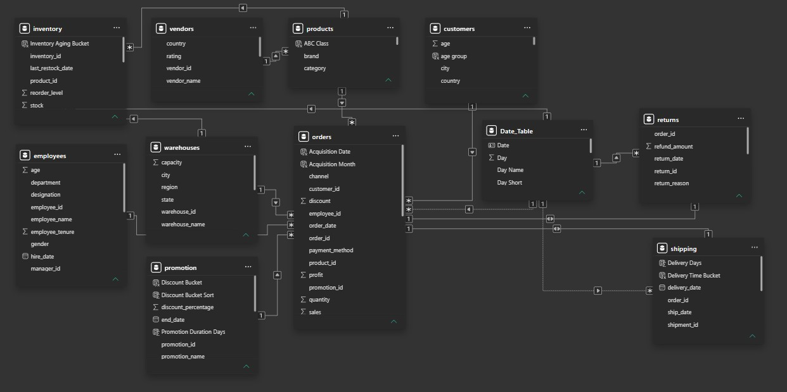

# 🛒 Enterprise E-commerce Analytics Platform

> **End-to-End Data Analytics Project using Python, SQL, MySQL, Power BI & Excel**


## 📌 Project Overview

This project simulates an **enterprise-level e-commerce analytics environment** designed to demonstrate how data can be collected, structured, analyzed and transformed into actionable business insights.

Rather than building a single sales dashboard, I created an interconnected analytics ecosystem covering:

* Sales
* Customers
* Products
* Inventory
* Warehouses
* Shipping
* Returns
* Vendors
* Promotions
* Employees

The project follows an end-to-end analytics workflow:

```text
Data Generation
      ↓
Data Cleaning & Validation
      ↓
Database / Data Modeling
      ↓
SQL Analysis
      ↓
Power BI Data Model
      ↓
DAX Measures
      ↓
Interactive Dashboards
      ↓
Business Insights & Recommendations
```

---

# 🎯 Project Objectives

The primary objective was to build a realistic analytics platform that could answer important business questions such as:

* How is the company performing financially?
* Which products and categories generate the most revenue?
* Who are the highest-value customers?
* Which products have inventory risks?
* Where are shipping delays occurring?
* Why are customers returning products?
* Which vendors are performing well or poorly?
* Are promotions generating profitable growth?
* How is the workforce distributed across departments and regions?

---

# 🏗️ Project Architecture


```text
                ┌────────────────────┐
                │   Python           │
                │ Data Generation    │
                └─────────┬──────────┘
                          │
                          ▼
                ┌────────────────────┐
                │ CSV / Raw Data     │
                └─────────┬──────────┘
                          │
                          ▼
                ┌────────────────────┐
                │ MySQL Database     │
                │ Data Modeling      │
                └─────────┬──────────┘
                          │
                          ▼
                ┌────────────────────┐
                │ SQL Analysis       │
                │ Business Queries   │
                └─────────┬──────────┘
                          │
                          ▼
                ┌────────────────────┐
                │ Power BI           │
                │ Data Model + DAX   │
                └─────────┬──────────┘
                          │
                          ▼
                ┌────────────────────┐
                │ Business Dashboards│
                └────────────────────┘
```

---

# 📊 Dataset Overview

The project contains multiple interconnected tables representing different business functions.

| Table      | Approx. Records | Purpose                    |
| ---------- | --------------: | -------------------------- |
| Customers  |          10,000 | Customer information       |
| Products   |           2,000 | Product catalog            |
| Orders     | 150,000–250,000 | Transactional sales        |
| Returns    |           8,000 | Product returns & refunds  |
| Inventory  |          15,000 | Stock & inventory analysis |
| Vendors    |             300 | Supplier information       |
| Employees  |             200 | Workforce information      |
| Warehouses |              50 | Warehouse operations       |
| Promotions |             500 | Promotional campaigns      |
| Shipping   |         150,000 | Delivery & logistics       |

The dataset was designed to simulate realistic relationships between customers, products, vendors, orders, inventory, shipping and returns.

---

# 🗄️ Database Schema



## Main Relationships

```text
Customers
    │
    └──── Orders
              │
              ├──── Products
              │       │
              │       └──── Vendors
              │
              ├──── Returns
              │
              └──── Shipping

Products
    │
    └──── Inventory
              │
              └──── Warehouses

Promotions
    │
    └──── Orders / Products

Employees
    │
    └──── Workforce / Management Analysis
```

---

# 🐍 Python — Data Generation

Python was used to create a large-scale synthetic e-commerce dataset.

The generation process includes:

* Customer generation
* Product generation
* Order generation
* Vendor generation
* Employee generation
* Warehouse generation
* Inventory generation
* Return generation
* Shipping generation
* Promotion generation

The dataset was intentionally designed with realistic relationships and distributions so that it could be used for SQL and Power BI practice.

### Python skills demonstrated

* Pandas
* NumPy
* Random data generation
* Date generation
* Data transformation
* Data validation
* CSV generation
* Automation

---

# 🗄️ SQL / MySQL Analysis

SQL was used to analyze the underlying business data.

Examples of analysis performed:

### Sales

* Monthly revenue
* Revenue growth
* Average Order Value
* Top products
* Top customers
* Category performance
* Profitability

### Customers

* New customers
* Repeat customers
* Customer spending
* Customer segmentation
* Customer lifetime value

### Products

* Best-selling products
* Low-performing products
* Product profitability
* Category performance

### Inventory

* Stock levels
* Low-stock products
* Inventory value
* Stock turnover

### Shipping

* Average delivery time
* Late deliveries
* On-time delivery rate
* Shipping cost

### Returns

* Return rate
* Return reasons
* Refund amount
* Category return rate

### Vendors

* Vendor performance
* Vendor ratings
* Return rates
* Sales contribution

SQL techniques used include:

* JOINs
* GROUP BY
* CASE statements
* Subqueries
* CTEs
* Window Functions
* Ranking
* Aggregations
* Date functions
* Conditional aggregation

---

# 📊 Power BI Dashboard

The Power BI solution contains multiple interconnected analytics pages.

---

# 1️⃣ Executive Dashboard


### Purpose

Provides a high-level overview of overall business performance.

### KPIs

* Total Sales
* Total Profit
* Profit Margin %
* Total Orders
* Total Customers
* Average Order Value
* Return Rate %
* On-Time Delivery %
* Inventory Value
* Active Promotions

### Key Questions

* How is the business performing?
* Is revenue growing?
* Is the company profitable?
* How many customers and orders are being generated?
* Are returns or delivery problems affecting performance?

---

# 2️⃣ Sales Analytics


### KPIs

* Total Sales
* Total Orders
* Average Order Value
* Average Discount
* Average Quantity

### Visualizations

* Daily Sales
* Monthly Sales
* Weekly Sales
* Sales by Channel
* Sales by Payment Method
* Sales by Order Status
* Monthly vs Daily Sales Heatmap
* Running Total Sales

### Business Questions

* When are sales highest?
* Which channels generate the most revenue?
* Which payment methods are most popular?
* How is sales performance changing over time?
* Which periods generate the highest order volume?

---

# 3️⃣ Customer Analytics


### KPIs

* Total Customers
* New Customers
* Repeat Customers
* Customer Retention %
* Average Customer Spend
* Average Orders per Customer

### Visualizations

* Customer Growth
* Sales by Customer Segment
* Customer Age Distribution
* Gender Distribution
* Top Customers
* Customer Lifetime Value
* Customers by City
* Revenue by State

### Business Questions

* Who are the highest-value customers?
* Are customers returning?
* Which customer segments generate the most revenue?
* Where are our customers located?
* How is the customer base growing?

---

# 4️⃣ Product Analytics


### Analysis

* Product performance
* Product sales
* Product profitability
* Category performance
* Top-selling products
* Low-performing products
* Product rankings

### Business Questions

* Which products generate the most revenue?
* Which categories are most profitable?
* Which products have weak performance?
* Which products should receive more attention?

---

# 5️⃣ Inventory Analytics


### KPIs

* Inventory Value
* Total Stock
* Low Stock Products
* Out-of-Stock Products
* Average Stock Level

### Analysis

* Stock levels
* Inventory value
* Low-stock products
* Warehouse inventory
* Product availability
* Inventory distribution

### Business Questions

* Which products are at risk of stockout?
* Where is inventory concentrated?
* Which warehouses hold the most inventory?
* Which products require replenishment?

---

# 6️⃣ Warehouse Analytics


### Analysis

* Warehouse capacity
* Inventory distribution
* Warehouse utilization
* Regional warehouse performance
* Stock levels by warehouse

### Business Questions

* Which warehouses hold the most inventory?
* Are warehouses being utilized efficiently?
* Which regions require additional warehouse capacity?
* Where are inventory bottlenecks occurring?

---

# 7️⃣ Shipping Analytics


### KPIs

* Orders Shipped
* On-Time Delivery %
* Average Delivery Days
* Late Deliveries
* Shipping Cost
* Average Shipping Cost
* Average Transit Time
* Delivery Success %

### Visualizations

* Shipping Trend
* Delivery Performance
* Late Deliveries
* Shipping Cost Trend
* Delivery Performance by Region
* Carrier / Shipping Performance

### Business Questions

* Are orders being delivered on time?
* Which regions have the most delays?
* Which shipments cost the most?
* How is delivery performance changing?

---

# 8️⃣ Returns Analytics


### KPIs

* Returned Orders
* Return Rate %
* Total Refund Amount
* Average Refund Amount
* Return Reasons
* Refund % of Sales

### Visualizations

* Return Trend
* Return Reasons
* Refund by Return Reason
* Return Rate by Category
* Refund by Category
* Return Reason × Category
* Top Returned Products

### Business Questions

* Why are customers returning products?
* Which categories have the highest return rate?
* Which products generate the most refunds?
* Is the financial impact of returns increasing?

### Advanced Analysis

A Pareto analysis can identify the small number of return reasons responsible for the majority of returns.

---

# 9️⃣ Vendor Analytics


### KPIs

* Total Vendors
* Active Vendors
* Average Vendor Rating
* Top Rated Vendors
* Low Rated Vendors
* Number of Vendor Countries

### Visualizations

* Vendors by Country
* Rating Distribution
* Top Vendors
* Sales by Vendor
* Vendor Return Rate
* Vendor Rating vs Return Rate
* Vendor Performance Scorecard

### Business Questions

* Which vendors generate the most revenue?
* Which vendors have the highest return rates?
* Does vendor rating correlate with product quality?
* Are we dependent on vendors from a specific country?
* Which vendors should be prioritized or monitored?

---

# 🔟 Promotion Analytics


### KPIs

* Total Promotions
* Active Promotions
* Upcoming Promotions
* Expired Promotions
* Average Discount %
* Highest Discount %

### Visualizations

* Promotion Status
* Promotion Type
* Discount Distribution
* Promotion Timeline
* Promotion Duration
* Discount vs Duration

### Business Questions

* How many promotions are currently active?
* What types of promotions are being used?
* How aggressive are the discounts?
* Which promotions run for unusually long periods?
* Which promotions generate profitable growth?

---

# 1️⃣1️⃣ Employee / Workforce Analytics


### KPIs

* Total Employees
* Average Salary
* Total Salary Cost
* Average Age
* Average Tenure
* Average Experience
* Managers

### Visualizations

* Employees by Department
* Salary by Department
* Salary Band Distribution
* Gender Distribution
* Age Distribution
* Tenure Distribution
* Hiring Trend
* Employees by Region
* Experience vs Salary
* Employee / Manager Scorecard

### Business Questions

* Where is the workforce concentrated?
* Which departments have the highest salary costs?
* How does salary change with experience?
* How has hiring changed over time?
* How are employees distributed across regions?
* Are management structures balanced?

---

# 🧮 Power BI / DAX

The project uses DAX measures for:

* KPIs
* Growth calculations
* Profit margins
* Return rates
* Delivery rates
* Customer metrics
* Ranking
* Running totals
* Time intelligence
* Average calculations
* Conditional metrics

Example:

```DAX
Return Rate % =
DIVIDE(
    [Returned Orders],
    [Total Orders],
    0
)
```

Example:

```DAX
Profit Margin % =
DIVIDE(
    [Total Profit],
    [Total Sales],
    0
)
```

---

# 📈 Business Insights

The objective of the dashboard is not simply to display numbers.

The analysis is designed to move from:

```text
DATA
 ↓
METRIC
 ↓
INSIGHT
 ↓
BUSINESS PROBLEM
 ↓
RECOMMENDATION
```

Example:

### Finding

A particular category has a significantly higher return rate than the company average.

### Possible Cause

A large percentage of returns are related to defective products.

### Business Recommendation

Investigate supplier quality, product inspection and fulfillment processes.

---

# 🧠 Key Skills Demonstrated

## Technical

* Python
* Pandas
* NumPy
* SQL
* MySQL
* Power BI
* DAX
* Data Modeling
* Data Cleaning
* Data Visualization
* Excel

## Analytical

* KPI Design
* Business Problem Solving
* Trend Analysis
* Customer Analytics
* Product Analytics
* Inventory Analytics
* Supply Chain Analytics
* Vendor Analytics
* Workforce Analytics
* Root Cause Analysis
* Business Recommendations

---

# 📁 Repository Structure

```text
Enterprise-Ecommerce-Analytics/
│
├── README.md
│
├── data/
│   ├── customers.csv
│   ├── products.csv
│   ├── orders.csv
│   ├── returns.csv
│   ├── inventory.csv
│   ├── vendors.csv
│   ├── employees.csv
│   ├── warehouses.csv
│   ├── promotions.csv
│   └── shipping.csv
│
├── python/
│   ├── generate_customers.py
│   ├── generate_products.py
│   ├── generate_orders.py
│   ├── generate_returns.py
│   ├── generate_inventory.py
│   ├── generate_vendors.py
│   ├── generate_employees.py
│   ├── generate_warehouses.py
│   ├── generate_promotions.py
│   └── generate_shipping.py
│
├── sql/
│   ├── create_database.sql
│   ├── create_tables.sql
│   ├── data_loading.sql
│   └── analysis_queries.sql
│
├── powerbi/
│   └── ecommerce_analytics.pbix
│
├── dax/
│   └── dax_measures.md
│
├── images/
│   ├── project-banner.png
│   ├── project-architecture.png
│   ├── database-schema.png
│   ├── executive-dashboard.png
│   ├── sales-dashboard.png
│   ├── customer-dashboard.png
│   ├── product-dashboard.png
│   ├── inventory-dashboard.png
│   ├── warehouse-dashboard.png
│   ├── shipping-dashboard.png
│   ├── returns-dashboard.png
│   ├── vendor-dashboard.png
│   ├── promotion-dashboard.png
│   └── employee-dashboard.png
│
└── documentation/
    ├── business_questions.md
    └── project_documentation.md
```

---

# 🚀 How to Use This Project

## Step 1 — Generate the Data

Run the Python scripts inside the `python/` directory.

```bash
python generate_customers.py
python generate_products.py
python generate_orders.py
```

Generate the remaining tables using their respective scripts.

---

## Step 2 — Load Data into MySQL

Create the database and tables using:

```text
sql/create_database.sql
sql/create_tables.sql
```

Then load the CSV files.

---

## Step 3 — Run SQL Analysis

Open:

```text
sql/analysis_queries.sql
```

and execute the business analysis queries.

---

## Step 4 — Open Power BI

Open:

```text
powerbi/ecommerce_analytics.pbix
```

Connect the required data sources and refresh the model.

---

# 📸 Dashboard Screenshots

All dashboard screenshots are stored in the `images/` directory.

The screenshots provide a quick overview of the final Power BI solution without requiring Power BI Desktop.

---

# 💡 Why I Built This Project

I wanted to move beyond creating isolated dashboards and build something closer to a **real-world analytics environment**.

The project helped me practice the complete Data Analyst workflow:

```text
Business Problem
       ↓
Data
       ↓
Data Modeling
       ↓
SQL
       ↓
Analysis
       ↓
Power BI
       ↓
Insights
       ↓
Business Recommendations
```

The biggest lesson from this project was that a good dashboard is not about having more charts.

It is about answering the **right business questions with reliable data**.

---

# 🔮 Future Improvements

Potential future improvements include:

* Customer churn prediction
* Sales forecasting
* Demand forecasting
* Product recommendation system
* Advanced customer segmentation
* Vendor risk scoring
* Inventory forecasting
* Promotion uplift analysis
* Automated reporting
* Machine learning models
* Power BI Service deployment
* Scheduled dashboard refresh

---

# 👨‍💻 About Me

**Abhishek Bansal**

Data Analyst | SQL | Python | Power BI | Excel | Business Analytics

I'm interested in solving business problems using data and building analytics solutions that turn raw data into actionable insights.

### Connect With Me

* LinkedIn: `https://www.linkedin.com/in/abhishek-bansal-data-analyst/`
* Portfolio: `https://codebasics.io/portfolio/Abhishek-Bansal`

---

# ⭐ If You Find This Project Useful

If this project helps you with your Data Analytics learning or interview preparation:

⭐ Star the repository
🍴 Fork the project
💬 Share your feedback
🔗 Connect with me on LinkedIn

---

## 📌 Project Summary

**Project:** Enterprise E-commerce Analytics Platform
**Domain:** E-commerce / Retail Analytics
**Tools:** Python, SQL, MySQL, Power BI, DAX, Excel
**Focus:** Sales, Customers, Products, Inventory, Shipping, Returns, Vendors, Promotions & Workforce Analytics

---

> **Built to demonstrate how a Data Analyst can transform raw business data into decisions.**
